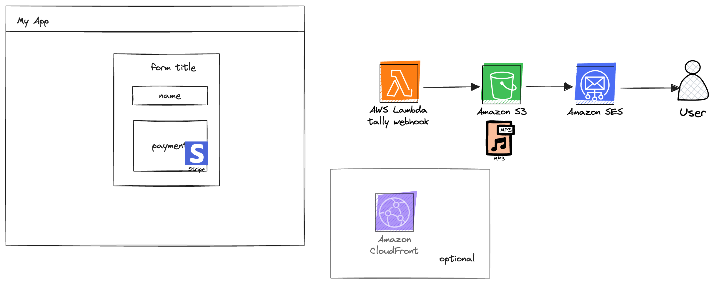

# Tally Webhook Email Song

Sometimes you just want a quick way to sell a digital product and have it emailed to the buyer. That's what this repo does!

## Overview

This application depends on a [Tally form](https://tally.so/) (see the Hero.tsx component) with two fields:

- Name Input: This field has a label name of `firstName`. The name is used in the body of the email.

- Email Input: This field has a label name of `email`.

There isn't much to this application but it uses AWS Amplify Gen2 to provide an end-to-end TypeScript experience.

The application UI only consists of a single landing page which contains a `Navbar`, `Hero`, and `Footer`.

The backend contains the following AWS Services:

- Amazon S3 Bucket: This is used to house the product that we would like to sell.

- AWS Lambda Function: This function is triggered when the Tally form is submitted. From there the following occurs:
  1. The Tally webhook signature is verified
  2. The item is gathered from S3 as a presigned URL
  3. The item is emailed to the customer using Amazon SES

> 🗒️ To prevent spam, Amazon places all SES accounts in sandbox mode. This means you can only send to verfied email addresses.
